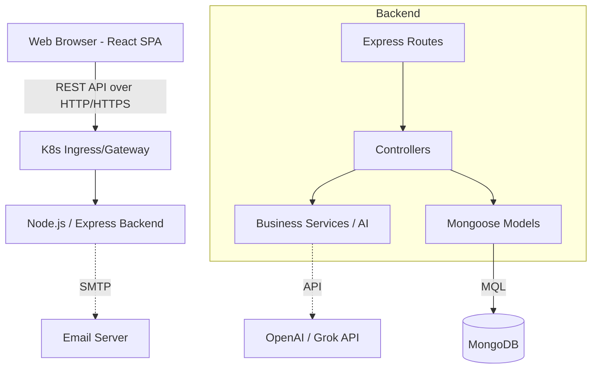

# 🚀 Comprehensive Project Analysis Report

## 1. PROJECT OVERVIEW
### What is this project?
This application is a **Competency and Performance Management System** (Gestion des Compétences). It is a comprehensive HR software platform built to track employee goals (objectives), facilitate regular check-ins, conduct performance evaluations (mid-year and final), manage feedback, and record HR decisions. 

### What problem does it solve?
It digitizes and formalizes the traditional performance review process, which is often done via spreadsheets or disjointed tools. It aligns employee goals with company objectives, ensures continuous feedback, and provides managers and HR with a centralized dashboard to track organizational performance and competency development.

### Target users/audience
- **Employees (Collaborators):** To set goals, submit check-ins, and view feedback.
- **Managers (Team Leaders):** To review team progress, conduct evaluations, and manage tasks.
- **Human Resources (HR) & Admins:** To oversee evaluation cycles, monitor company-wide completion rates, configure settings, and handle sensitive HR decisions.

### Key features and capabilities
- 🎯 **Goal Management:** Hierarchical objectives with progress tracking and KPIs.
- 🔄 **Evaluation Cycles:** Structured mid-year and final performance assessments.
- 💬 **Continuous Feedback:** Peer and manager feedback mechanisms.
- 📊 **Dashboards & Analytics:** Data visualization for team and individual performance.
- 🏢 **Team & Organizational Structure:** Managing reporting lines and team composition.
- 🤖 **AI Integration (Optional):** Generation of development plans and review drafts.

### Technology stack summary
- **Frontend:** React.js 18 with Vite, React Router, Chart.js, Tailwind/Vanilla CSS.
- **Backend:** Node.js, Express.js.
- **Database:** MongoDB (via Mongoose ORM).
- **Infrastructure:** Docker, Kubernetes (with Kustomize), ArgoCD for GitOps.

---

## 2. ARCHITECTURE ANALYSIS
### Overall Architectural Pattern
The application utilizes a **Monolithic Client-Server Architecture** heavily based on the **MERN** stack (MongoDB, Express, React, Node.js), deployed in a containerized environment. The backend follows a strict **MVC (Model-View-Controller)** pattern.

### System Architecture Diagram

### Component Relationships and Dependencies
- **Frontend App Shell:** Provides routing, auth context, and a persistent sidebar.
- **Backend Routes:** Map HTTP requests to specific controller methods.
- **Middlewares:** Handle authentication (`auth.js`), authorization (`role.js`), input validation (`validate.js`), and security (`rateLimiter.js`, `xss`, `mongo-sanitize`).

### Scalability Considerations ⚡
- **Stateless Backend:** The Node.js application uses JWT for authentication, meaning it is entirely stateless and can be horizontally scaled across multiple Kubernetes pods.
- **Database:** MongoDB allows for replica sets and sharding if data volume grows significantly.

### Security Architecture 🔒
- **Authentication:** JWT (JSON Web Tokens) with short-lived access tokens.
- **Authorization:** Role-Based Access Control (RBAC) enforced at the middleware layer.
- **Data Protection:** Passwords hashed with `bcryptjs`. Protection against NoSQL Injection and XSS via middleware.

---

## 3. DIRECTORY STRUCTURE BREAKDOWN

### `frontend/`
- **Purpose:** Contains the React Single Page Application (SPA).
- **`src/components/`**: Reusable UI components (Modals, Buttons, Cards).
- **`src/pages/`**: Top-level route components representing full views (Dashboard, Goals, etc.).
- **`src/api/` & `src/services/`**: Axios wrappers for backend communication.

### `backend/`
- **Purpose:** The Express RESTful API and core business logic.
- **`controllers/`**: The "brains" of the routes. Handles request parsing, model interaction, and responses.
- **`models/`**: Mongoose schemas defining the data structure.
- **`routes/`**: Express routers mapping endpoints to controllers.
- **`middleware/`**: Functions that run before controllers (auth, logging).

### `k8s/`
- **Purpose:** Kubernetes manifests for deployment.
- **`base/`**: Core deployments and services.
- **`overlays/`**: Environment-specific configurations (dev, qa, staging, prod) using Kustomize.

---

## 4. FILE-BY-FILE ANALYSIS
*Below is a comprehensive matrix detailing the purpose, responsibilities, and dependencies of every file in the project.*

> [!NOTE]
> This table provides a complete architectural map of the codebase.

| File Path | Purpose & Responsibilities | Key Components/Functions | Dependencies |
|---|---|---|---|
| `backend/app.js` | Express app setup, security middlewares, route registration | - | dotenv, express, cors, helmet, xss-clean |
| `backend/server.js` | Entry point. Connects to MongoDB and starts the HTTP server | - | dotenv, mongoose, ./app |
| `backend/models/User.js` | DB schema for Users (roles, auth, profile) | userSchema | mongoose, bcryptjs |
| `backend/models/Objective.js` | DB schema for Goals and KPIs | objectiveSchema | mongoose |
| `backend/models/Evaluation.js` | DB schema for performance evaluations | evaluationSchema | mongoose |
| `backend/models/Cycle.js` | DB schema for evaluation cycles and phases | cycleSchema | mongoose |
| `backend/models/Team.js` | DB schema for teams and reporting hierarchy | teamSchema | mongoose |
| `backend/models/Feedback.js` | DB schema for peer and manager feedback | feedbackSchema | mongoose |
| `backend/models/Task.js` | DB schema for actionable tasks | taskSchema | mongoose |
| `backend/models/Meeting.js` | DB schema for 1-on-1s and reviews | meetingSchema | mongoose |
| `backend/models/Notification.js` | DB schema for in-app alerts | notificationSchema | mongoose |
| `backend/models/HRDecision.js` | DB schema for promotions, bonuses, PIPs | hrDecisionSchema | mongoose |
| `backend/models/AuditLog.js` | DB schema for tracking sensitive actions | auditLogSchema | mongoose |
| `backend/models/CareerPath.js` | DB schema for career progression plans | careerPathSchema | mongoose |
| `backend/controllers/authController.js` | Business logic for login, registration | login, register | ../models/User, jsonwebtoken |
| `backend/controllers/objectiveController.js` | Business logic for goal management | createObjective, updateProgress | ../models/Objective |
| `backend/controllers/evaluationController.js` | Business logic for reviews | submitEvaluation, calculateScore | ../models/Evaluation |
| `backend/controllers/userController.js` | Business logic for user management | getUsers, updateUser | ../models/User |
| `backend/controllers/teamController.js` | Business logic for team structures | createTeam, getTeamMetrics | ../models/Team |
| `backend/controllers/cycleController.js` | Business logic for admin cycles | createCycle, updatePhase | ../models/Cycle |
| `backend/controllers/aiController.js` | AI draft and summary generation | generateReview, getGoalSuggestions | openai, ../services/aiService |
| `backend/routes/*.js` | Express API Routers mapping HTTP methods to Controllers | router.get, router.post | express, ../controllers/* |
| `backend/middleware/auth.js` | Verifies JWT tokens on protected routes | verifyToken | jsonwebtoken |
| `backend/middleware/role.js` | Enforces Role-Based Access Control | requireRole | - |
| `backend/middleware/audit.js` | Automatically logs actions to DB | auditLogger | ../models/AuditLog |
| `backend/cron/reminderCron.js` | Background jobs for sending reminders | startCron | node-cron |
| `backend/services/aiService.js` | Wrapper for LLM integrations | generateText | openai |
| `backend/utils/mailer.js` | Email sending utility | sendEmail | nodemailer |
| `frontend/src/App.jsx` | React Router definitions & Context Providers | App | react-router-dom |
| `frontend/src/main.jsx` | React DOM root render | - | react-dom |
| `frontend/src/pages/Dashboard.jsx` | Main landing view with widgets | Dashboard | react, ../components/* |
| `frontend/src/pages/GoalsPage.jsx` | Goal management interface | GoalsPage | react, ../api/objectives |
| `frontend/src/pages/Evaluations.jsx` | UI for completing performance reviews | Evaluations | react |
| `frontend/src/pages/Teams.jsx` | UI for team management | Teams | react |
| `frontend/src/components/DashboardLayout.jsx` | Application shell with Sidebar and Header | DashboardLayout | react |
| `frontend/src/components/EnterpriseSidebar.jsx` | Persistent navigation menu | EnterpriseSidebar | react-router-dom |
| `frontend/src/components/AuthContext.jsx` | Global state for authenticated user | AuthProvider, useAuth | react, axios |
| `frontend/src/api/apiClient.js` | Axios instance with auth interceptors | apiClient | axios |
| `k8s/base/backend-deployment.yaml` | K8s Deployment and Service for Node app | - | - |
| `k8s/base/frontend-deployment.yaml` | K8s Deployment and Service for Vite app | - | - |
| `k8s/overlays/*/kustomization.yaml` | Environment specific K8s patches | - | - |

---

## 5. CORE FUNCTIONALITY DEEP-DIVE
### Main User Workflows
1. **Authentication:** User logs in. Frontend stores JWT token. `AuthContext` provides user role to the UI, enabling/disabling sidebar links.
2. **Goal Setting (Objectives):** Employee creates a goal. Status is set to `draft`. Manager reviews and approves. Employee submits regular progress check-ins.
3. **Evaluation Cycle:** HR creates a `Cycle` (e.g., "2026 Annual Review"). It moves through phases: `Goal Setting -> Mid-Year -> Final -> Closed`. The system locks/unlocks features based on the active phase.

### State Management Approach
- **Global:** React Context (`AuthContext`, `ThemeContext`) for user state and UI themes.
- **Local:** React `useState` and `useEffect` are heavily used within pages to fetch and store tabular data.

### Error Handling Strategy
- **Backend:** A centralized `errorHandler.js` middleware catches all next(err) calls. It formats Mongoose validation errors and DB constraints into user-friendly JSON responses.
- **Frontend:** API calls are wrapped in `try/catch`. Errors trigger UI notifications using a custom `Toast` component.

---

## 6. DATA LAYER
### Database Schema and Models
The system uses MongoDB (NoSQL) but implements highly relational patterns via Mongoose `ref` populations.

**Entity Relationship Overview:**
- `User` 1:N `Objective`
- `User` 1:N `Evaluation`
- `Team` 1:N `User`
- `Cycle` 1:N `Objective` (Objectives are tied to specific time periods)

### Data Validation
Enforced heavily at two layers:
1. **Joi Validation:** Express middleware (`validators/schemas.js`) checks incoming request payloads.
2. **Mongoose Schema:** DB-level strict typing, required fields, and enums (e.g., statuses like `pending`, `approved`, `completed`).

---

## 7. EXTERNAL DEPENDENCIES
### Backend
- **Express.js:** Core web framework.
- **Mongoose:** Object Data Modeling (ODM) for MongoDB.
- **Bcryptjs & JsonWebToken:** Security for passwords and sessions.
- **Node-Cron:** For background tasks (reminders).
- **PDFKit:** For generating physical evaluation reports.

### Frontend
- **Vite:** Next-generation build tool replacing Webpack. Fast HMR.
- **React Router DOM:** Client-side routing.
- **Axios:** HTTP client for API requests.
- **Chart.js & React-Chartjs-2:** Rendering analytics dashboards.
- **Date-fns:** Lightweight date manipulation.

---

## 8. CONFIGURATION & ENVIRONMENT
### Environment Variables
**Backend (`backend/.env`):**
- `MONGO_URI`: Connection string.
- `JWT_SECRET`: Used to sign tokens.
- `PORT`: Application port.

**Frontend (`frontend/.env`):**
- `VITE_API_URL`: Points to the backend endpoint.

### Environments
Managed via Kubernetes Kustomize (`/k8s/overlays/`):
- **Dev:** Rapid iteration, debug logging enabled.
- **QA/Staging:** Mirrored production environments for testing.
- **Prod:** Highly available, strict security policies.

---

## 9. BUILD & DEPLOYMENT
### Build Process
- **Frontend:** `npm run build` compiles React/Vite into static HTML/JS/CSS assets in the `dist/` folder. Docker image serves this via Nginx (standard practice, implied by Dockerfile).
- **Backend:** `npm start` runs the Node server directly. Docker image copies `package.json`, installs dependencies, and runs the app.

### Deployment Pipeline
The presence of `argocd-app.yaml` indicates a GitOps deployment strategy. Changes merged to Git are automatically synced and applied to the Kubernetes cluster by ArgoCD.

---

## 10. TESTING STRATEGY
- **Backend Tests:** Jest and Supertest are configured (`backend/tests/app.test.js`). They perform integration testing against the Express API endpoints.
- **Frontend Tests:** ESLint is used heavily for static analysis to catch syntax and standard errors before compilation.

---

## 11. POTENTIAL MANAGEMENT QUESTIONS & ANSWERS
Prepare for these questions in your meeting:

**Q: "How does this scale if we double our workforce?"**
> **A:** The system is highly scalable. The frontend is delivered statically. The Node.js backend is entirely stateless, meaning we can spin up additional Kubernetes pods instantly to handle increased traffic. MongoDB handles high read/write loads efficiently.

**Q: "What are the security considerations?"**
> **A:** Security is baked in. We use JWTs for authentication, Bcrypt for password hashing, and Express middlewares to prevent XSS and NoSQL injection attacks. Sensitive actions are logged in an immutable `AuditLog` collection.

**Q: "How long would it take to add a new '360-Review' feature?"**
> **A:** The architecture already supports `Feedback` objects. Expanding this into formal 360-reviews would require adding a new UI module and modifying the Evaluation model to aggregate peer feedback, estimating roughly 2-3 sprints of work.

**Q: "What's the maintenance burden?"**
> **A:** Low to medium. The MERN stack is highly standard. By utilizing Kubernetes and GitOps (ArgoCD), deployment and rollback are automated.

---

## 12. TECHNICAL DEBT & IMPROVEMENTS
💡 **Recommendations for the Future:**
1. **State Management Refactor:** Moving from scattered `useState` data fetching to a caching library like **React Query** or RTK Query will drastically improve frontend performance and reduce duplicate API calls.
2. **TypeScript Migration:** The codebase is currently pure JavaScript. Migrating to TypeScript would reduce runtime errors and improve developer experience.
3. **Pagination:** Ensure all list APIs (e.g., `/api/audit-logs`) implement strict pagination to prevent database overload as historical data grows.

---

## 13. METRICS & MONITORING
- **Audit Logs:** The application tracks administrative changes in the `AuditLog` collection, viewable in the UI by HR/Admins.
- **Health Checks:** A dedicated `/api/health` endpoint exists for Kubernetes readiness and liveness probes to ensure traffic is only routed to healthy pods.

---

## 14. QUICK REFERENCE CHEAT SHEET
- **Stack:** React, Vite, Node, Express, MongoDB.
- **Start Local Backend:** `cd backend && npm run dev`
- **Start Local Frontend:** `cd frontend && npm run dev`
- **Critical Flow:** Cycle Phases dictate app behavior. If users can't create goals, check if the Cycle is in the "Goal Setting" phase.
- ⚠️ **Gotcha:** Environment variables must be set before building the frontend, as Vite bakes `VITE_API_URL` into the compiled static files.

***
*Generated automatically by system audit for Management Presentation preparation.*
